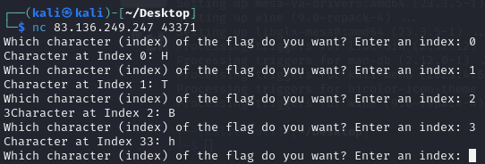
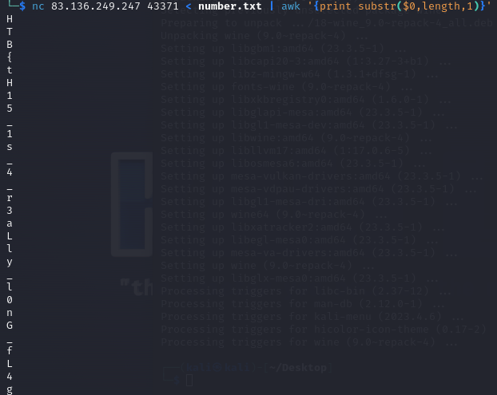

this is when we connect to the challenge as u can see this might me quite long index so we need to gen number line by line to use in the command(in this part im lazy so i use chatgpt to gen number line by line for me)

i contain my number in number.txt then print only last index of every single line(if it longer than this we need to write it to file
