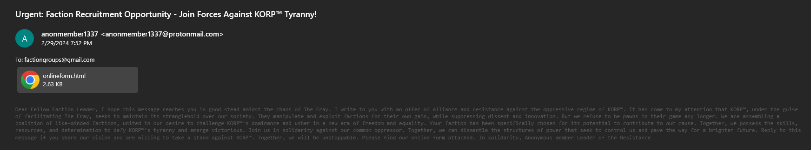
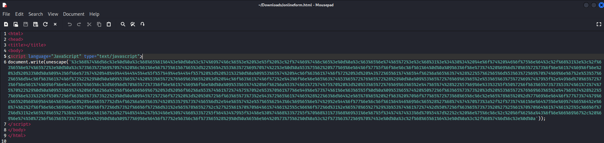
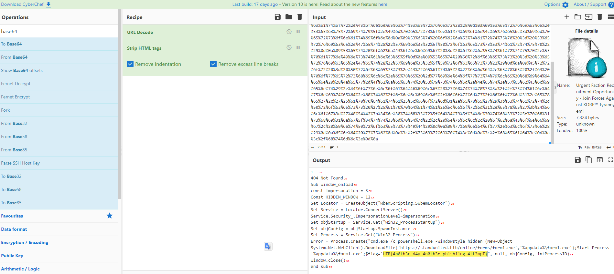

as a .eml file is an electronic mail format or email saved in plain text. Users can receive and send these files through RFC-822 compliant email
so you can open with email application like Mail, Outlook, etc. or use .eml viewer https://www.encryptomatic.com/viewer/
and here is how it look like

after you get online form you just need to open it

