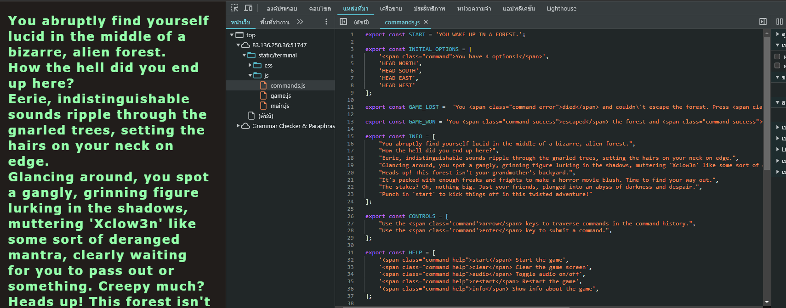
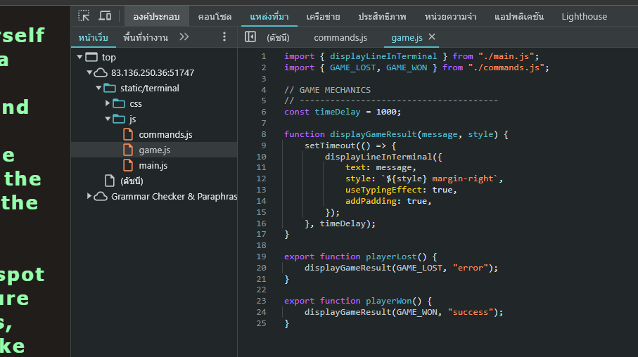
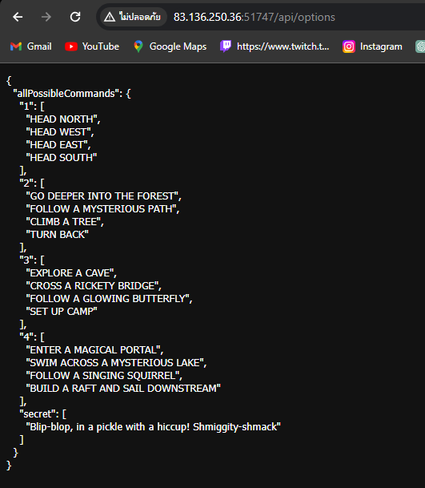
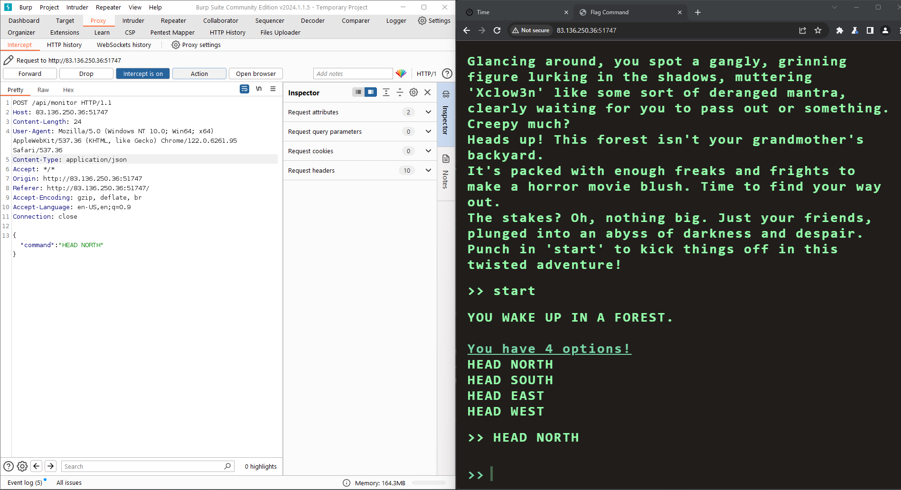
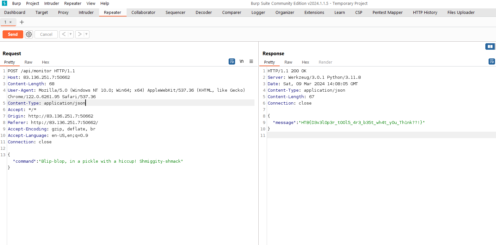

from this site it like a game that we have to choose path to find the flag but we will skip that
let see the code


```js
import { START, INFO, INITIAL_OPTIONS, HELP } from "./commands.js";
import { playerLost, playerWon } from "./game.js";

let availableOptions;

let currentStep = 1;
// SELECT HTML ELEMENTS
// ---------------------------------------
export const beforeDiv = document.getElementById("before-div"),
    currentCommandLine = document.getElementById("current-command-line"),
    commandText = document.getElementById("commad-written-text"),
    userTextInput = document.getElementById("user-text-input");

const typingSound = new Audio();
typingSound.src = document.getElementById("typing-sound").src;
typingSound.loop = true;

// COMMANDER VARIABLES
// ---------------------------------------
let currentCommand = 0,
    commandHistory = [],
    typingSpeed = 10,
    typing = true,
    playAudio = true,
    fetchingResponse = false,
    gameStarted = false,
    gameEnded = false;

export const startCommander = async () => {
    await fetchOptions();
    userTextInput.value = "";
    commandText.innerHTML = userTextInput.value;

    await displayLinesInTerminal({ lines: INFO });

    userTextInput.focus();
};

// HTTP REQUESTS
// ---------------------------------------
async function CheckMessage() {
    fetchingResponse = true;
    currentCommand = commandHistory[commandHistory.length - 1];

    if (availableOptions[currentStep].includes(currentCommand) || availableOptions['secret'].includes(currentCommand)) {
        await fetch('/api/monitor', {
            method: 'POST',
            headers: {
                'Content-Type': 'application/json'
            },
            body: JSON.stringify({ 'command': currentCommand })
        })
            .then((res) => res.json())
            .then(async (data) => {
                console.log(data)
                await displayLineInTerminal({ text: data.message });

                if(data.message.includes('Game over')) {
                    playerLost();
                    fetchingResponse = false;
                    return;
                }

                if(data.message.includes('HTB{')) {
                    playerWon();
                    fetchingResponse = false;

                    return;
                }

                if (currentCommand == 'HEAD NORTH') {
                    currentStep = '2';
                }
                else if (currentCommand == 'FOLLOW A MYSTERIOUS PATH') {
                    currentStep = '3'
                }
                else if (currentCommand == 'SET UP CAMP') {
                    currentStep = '4'
                }

                let lineBreak = document.createElement("br");


                beforeDiv.parentNode.insertBefore(lineBreak, beforeDiv);
                displayLineInTerminal({ text: '<span class="command">You have 4 options!</span>' })
                displayLinesInTerminal({ lines: availableOptions[currentStep] })
                fetchingResponse = false;
            });


    }
    else {
        displayLineInTerminal({ text: "You do realise its not a park where you can just play around and move around pick from options how are hard it is for you????" });
        fetchingResponse = false;
    }
}

// TEXT FUNCTIONS
// ---------------------------------------
const typeText = async (element, text) => {
    if (playAudio && typingSound.paused) {
        typingSound.play();
    }

    for (let i = 0; i < text.length; i++) {
        if (text.charAt(i) === " " && text.charAt(i + 1) === " ") {
            element.innerHTML += "&nbsp;&nbsp;";
            i++;
        } else {
            element.innerHTML += text.charAt(i);
        }
        await new Promise((resolve) => setTimeout(resolve, typingSpeed));
    }

    if (playAudio) {
        typingSound.pause();
        typingSound.currentTime = 0;
    }
};

const createNewLineElement = ({ style = "", addPadding = false }) => {
    // remove the current command line until new line is displayed
    currentCommandLine.classList.remove("visible");
    currentCommandLine.style.opacity = 0;

    const nextLine = document.createElement("p");

    // add style depending on the type of line
    nextLine.className = style + (addPadding ? " spaced-line" : "");

    beforeDiv.parentNode.insertBefore(nextLine, beforeDiv);
    window.scrollTo(0, document.body.offsetHeight);

    return nextLine;
};

// process remaining text with styled and unstyled parts and apply typing effect
const processTextWithTypingEffect = async (nextLine, text) => {
    let remainingText = text;

    // process remaining text with styled and unstyled parts
    while (remainingText) {
        const styledElementMatch = remainingText.match(/<(\w+)(?:\s+class=['"]([^'"]*)['"])?>([^<]*)<\/\1>/);
        const unstyledText = styledElementMatch ? remainingText.slice(0, styledElementMatch.index) : remainingText;

        // handle unstyled text
        if (unstyledText) {
            await typeText(nextLine, unstyledText);
        }

        // handle styled text
        if (styledElementMatch) {
            const [, tagName, className, innerText] = styledElementMatch;
            const styledElement = document.createElement(tagName);
            if (className) {
                styledElement.className = className;
            }
            nextLine.appendChild(styledElement);
            await typeText(styledElement, innerText);
            remainingText = remainingText.slice(styledElementMatch.index + styledElementMatch[0].length);
        } else {
            remainingText = null;
        }
    }
};

// display a line in the terminal with optional styling and typing effect
export const displayLineInTerminal = async ({ text = "", style = "", useTypingEffect = true, addPadding = false }) => {
    typing = true;

    // create and style a new line element
    const nextLine = createNewLineElement({ style, addPadding });

    // use typing effect if enabled
    await processTextWithTypingEffect(nextLine, text);


    // reset typing flag and make the current command line visible
    typing = false;
    currentCommandLine.style.opacity = 1;
    currentCommandLine.classList.add("visible");
};

// display multiple lines in the terminal with optional styling and typing effect
export const displayLinesInTerminal = async ({ lines, style = "", useTypingEffect = true }) => {
    for (let i = 0; i < lines.length; i++) {
        await new Promise((resolve) => setTimeout(resolve, 0));

        await displayLineInTerminal({ text: lines[i], style: style });
    }
};

// EVENT LISTENERS
// ---------------------------------------
// user input keydown event listener
const keyBindings = {
    Enter: () => {
        // if a response is being fetched, do nothing on Enter
        if (fetchingResponse) {
            return;
        } else {
            commandHistory.push(commandText.innerHTML);
            currentCommand = commandHistory.length;
            displayLineInTerminal({ text: `>> ${commandText.innerHTML}`, useTypingEffect: true, addPadding: true });
            commander(commandText.innerHTML.toLowerCase());
            commandText.innerHTML = "";
            userTextInput.value = "";
        }
    },

    ArrowUp: () => {
        if (currentCommand > 0) {
            currentCommand -= 1;
            commandText.innerHTML = commandHistory[currentCommand];
            userTextInput.value = commandHistory[currentCommand];
        }
    },

    ArrowDown: () => {
        if (currentCommand < commandHistory.length) {
            currentCommand += 1;
            if (commandHistory[currentCommand] === undefined) {
                userTextInput.value = "";
            } else {
                userTextInput.value = commandHistory[currentCommand];
            }
            commandText.innerHTML = userTextInput.value;
        }
    },
};

// available user commands
export const commandBindings = {
    help: () => {
        displayLinesInTerminal({ lines: HELP });
    },

    start: async () => {
        await displayLineInTerminal({ text: START });
        let lineBreak = document.createElement("br");

        beforeDiv.parentNode.insertBefore(lineBreak, beforeDiv);
        await displayLinesInTerminal({ lines: INITIAL_OPTIONS });
        gameStarted = true;
    },
    clear: () => {
        while (beforeDiv.previousSibling) {
            beforeDiv.previousSibling.remove();
        }
    },

    audio: () => {
        if (playAudio) {
            playAudio = false;
            displayLineInTerminal({ text: "Audio turned off" });
        } else {
            playAudio = true;
            displayLineInTerminal({ text: "Audio turned on" });
        }
    },

    restart: () => {
        let count = 6;

        function updateCounter() {
            count--;

            if (count <= 0) {
                clearInterval(counter);
                return location.reload();
            }

            displayLineInTerminal({
                text: `Game will restart in ${count}...`,
                style: status,
                useTypingEffect: true,
                addPadding: false,
            });
        }

        // execute the code block immediately before starting the interval
        updateCounter();
        currentStep = 1

        let counter = setInterval(updateCounter, 1000);
    },

    info: () => {
        displayLinesInTerminal({ lines: INFO });
    },
};

// keyup event listener
export const enterKey = (event) => {
    if (!typing) {
        if (event.key in keyBindings) {
            keyBindings[event.key]();
            event.preventDefault();
        } else {
            commandText.innerHTML = userTextInput.value;
        }
    }
};

// command handler
const commander = (commandText) => {
    const cleanCommand = commandText.toLowerCase().trim();

    // Possible states:
    // 1. game has not started (gameStarted = false)
    // 2. game is in progress (gameStarted = true, gameEnded = false)
    // 3. game has ended (gameStarted = true, gameEnded = true)

    if (cleanCommand in commandBindings) {
        if (!gameStarted) {
            // game has not started
            commandBindings[cleanCommand]();
        } else if (gameStarted && !gameEnded) {
            // game is in progress
            commandBindings[cleanCommand]();
        } else {
            // game has ended
            if (cleanCommand === "restart" || cleanCommand !== "start") {
                commandBindings[cleanCommand]();
            } else {
                displayEndGameMessage();
            }
        }
    } else {
        if (gameStarted && !gameEnded) {
            CheckMessage();
        } else if (gameEnded) {
            displayEndGameMessage();
        } else {
            displayLineInTerminal({
                text: `'${cleanCommand}' command not found. For a list of commands, type '<span class="command">help</span>'`,
                useTypingEffect: true,
            });
        }
    }
};

const displayEndGameMessage = () => {
    displayLineInTerminal({
        text: "The game has ended. Please type <span class='command'>restart</span> to start a new game or <span class='command'>help</span> for a list of commands.",
        useTypingEffect: true,
    });
};

const fetchOptions = () => {
    fetch('/api/options')
        .then((data) => data.json())
        .then((res) => {
            availableOptions = res.allPossibleCommands;

        })
        .catch(() => {
            availableOptions = undefined;
        })
}
```
as we can see that we need secret in availableOptions at async function CheckMessage()
we found interesting api from this function const fetchOptions so go to it

all commands are leak so we need secret to get the flag by using burp suite

change the parameter to get the flag
